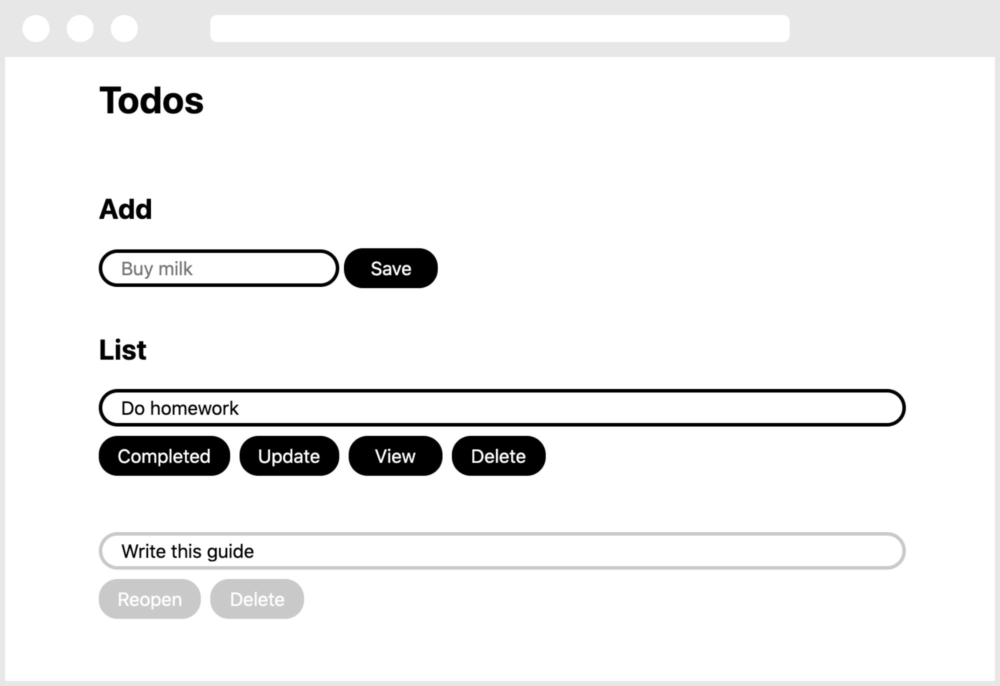

# Svelte Rest Demo

Demo todo app for Svelte consuming a REST API



## 🚀 Running it

```bash
cd ./client
yarn            # or npm i
yarn run dev    # or npm run dev

# In a different terminal
cd ./server
yarn 
yarn run dev
```

The app will be served under http://localhost:3000, the server http://localhost:8000
